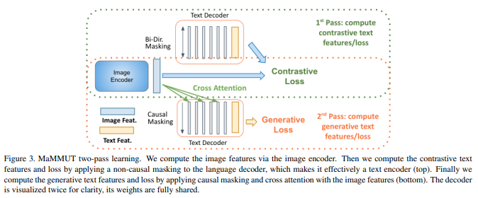

</img>

## MaMMUT - Pytorch

Implementation of <a href="https://arxiv.org/abs/2303.16839">MaMMUT</a>, a simple vision-encoder text-decoder architecture for multimodal tasks from Google, in Pytorch. <a href="https://ai.googleblog.com/2023/05/mammut-simple-vision-encoder-text.html">Blog post</a>

This work is basically just a simplified CoCa. I copied the code from <a href="https://github.com/lucidrains/CoCa-pytorch">this repository</a> and made the change in the paper, which was to simply do two passes through the text encoder, one with cross attention for the generative loss, and the other without for the contrastive loss.

This is also a good time to plug <a href="https://laion.ai/blog/coca/">an open sourced version of CoCa</a> from the folks at <a href="https://github.com/mlfoundations/open_clip">OpenCLIP</a>!

## Appreciation

- <a href="https://stability.ai/">Stability</a> and <a href="https://huggingface.co/">🤗 Huggingface</a> for their generous sponsorships to work on and open source cutting edge artificial intelligence research

## Install

```bash
$ pip install mammut-pytorch
```

## Usage

First install the `vit-pytorch` for the image encoder, which needs to be pretrained

```bash
$ pip install vit-pytorch>=0.40.2
```

Then

```python
import torch

# import vision transformer

from vit_pytorch.simple_vit_with_patch_dropout import SimpleViT
from vit_pytorch.extractor import Extractor

vit = SimpleViT(
    image_size = 256,
    patch_size = 32,
    num_classes = 1000,
    dim = 1024,
    depth = 6,
    heads = 16,
    mlp_dim = 2048,
    patch_dropout = 0.5  # https://arxiv.org/abs/2212.00794
)

vit = Extractor(vit, return_embeddings_only = True, detach = False)

# extractor will enable it so the vision transformer returns its embeddings

# import MaMMUT and instantiate it

from mammut_pytorch.mammut_pytorch import MaMMUT

mammut = MaMMUT(
    dim = 512,                     # model dimension
    img_encoder = vit,             # vision transformer - image encoder, returning image embeddings as (batch, seq, dim)
    image_dim = 1024,              # image embedding dimension, if not the same as model dimensions
    num_tokens = 20000,            # number of text tokens
    depth = 6,                     # depth of the transformer
    dim_head = 64,                 # dimension per attention head
    heads = 8,                     # number of attention heads
    caption_loss_weight = 1.,      # weight on the autoregressive caption loss
    contrastive_loss_weight = 1.,  # weight on the contrastive loss between image and text CLS embeddings
).cuda()

# mock text and images

text = torch.randint(0, 20000, (4, 512)).cuda()
images = torch.randn(4, 3, 256, 256).cuda()

# train by giving MaMMUT your text and images with `return_loss = True`

loss = mammut(
    text = text,
    images = images,
    return_loss = True  # set this to True to get the full caption + contrastive loss
)

loss.backward()

# do the above for as much text and images...
# then you can get the caption logits as so

logits = mammut(
    text = text,
    images = images
) # (4, 512, 20000)

# and the CLIP-like text and image embeddings as

text_embeds, image_embeds = mammut(
    text = text,
    images = images,
    return_embeddings = True
) # (4, 512), (4, 512)
```

One of the main findings of the paper is that different tasks perform differently depending on the amount of cross attention. This repository will give you full control over how much cross attention you want to place in the network.

```python
mammut = MaMMUT(
    dim = 512,
    img_encoder = vit,
    image_dim = 1024,
    num_tokens = 20000,
    depth = 6,
    cross_attend_every = 2,   # say you want to cross attend only every 2 layers
    dim_head = 64,
    heads = 8,
    caption_loss_weight = 1.,
    contrastive_loss_weight = 1.
).cuda()

# or you can finely specify which layers to do cross attention

mammut = MaMMUT(
    dim = 512,
    img_encoder = vit,
    image_dim = 1024,
    num_tokens = 20000,
    depth = 6,
    cross_attend_layers = (4, 5, 6),  # only last three layers have cross attention
    dim_head = 64,
    heads = 8,
    caption_loss_weight = 1.,
    contrastive_loss_weight = 1.
).cuda()
```

## Todo

- [ ] offer masked mean pooling of text embeddings and mean pooling for images for contrastive latents

## Citations

```bibtex
@article{Kuo2023MaMMUTAS,
    title   = {MaMMUT: A Simple Architecture for Joint Learning for MultiModal Tasks},
    author  = {Weicheng Kuo and A. J. Piergiovanni and Dahun Kim and Xiyang Luo and Benjamin Caine and W. Li and Abhijit S. Ogale and Luowei Zhou and Andrew M. Dai and Zhifeng Chen and Claire Cui and Anelia Angelova},
    journal = {ArXiv},
    year    = {2023},
    volume  = {abs/2303.16839}
}
```

```bibtex
@inproceedings{Chowdhery2022PaLMSL,
    title   = {PaLM: Scaling Language Modeling with Pathways},
    author  = {Aakanksha Chowdhery and Sharan Narang and Jacob Devlin and Maarten Bosma and Gaurav Mishra and Adam Roberts and Paul Barham and Hyung Won Chung and Charles Sutton and Sebastian Gehrmann and Parker Schuh and Kensen Shi and Sasha Tsvyashchenko and Joshua Maynez and Abhishek Rao and Parker Barnes and Yi Tay and Noam M. Shazeer and Vinodkumar Prabhakaran and Emily Reif and Nan Du and Benton C. Hutchinson and Reiner Pope and James Bradbury and Jacob Austin and Michael Isard and Guy Gur-Ari and Pengcheng Yin and Toju Duke and Anselm Levskaya and Sanjay Ghemawat and Sunipa Dev and Henryk Michalewski and Xavier Garc{\'i}a and Vedant Misra and Kevin Robinson and Liam Fedus and Denny Zhou and Daphne Ippolito and David Luan and Hyeontaek Lim and Barret Zoph and Alexander Spiridonov and Ryan Sepassi and David Dohan and Shivani Agrawal and Mark Omernick and Andrew M. Dai and Thanumalayan Sankaranarayana Pillai and Marie Pellat and Aitor Lewkowycz and Erica Oliveira Moreira and Rewon Child and Oleksandr Polozov and Katherine Lee and Zongwei Zhou and Xuezhi Wang and Brennan Saeta and Mark Diaz and Orhan Firat and Michele Catasta and Jason Wei and Kathleen S. Meier-Hellstern and Douglas Eck and Jeff Dean and Slav Petrov and Noah Fiedel},
    year    = {2022}
}
```
